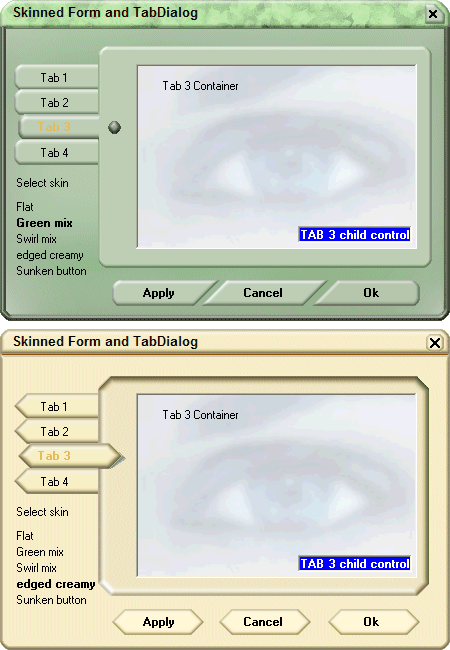



## Transparent tabbed form with skinnable tabs \(GUI\)

### Description

This example will show you one of the ways to make forms and tabs skinable.

Thanks! u32
 
### More Info
 

             |
---                |---
**Submitted On**   |2008-09-27 20:15:46
**By**             |[u32](https://github.com/Planet-Source-Code/PSCIndex/blob/master/ByAuthor/u32.md)
**Level**          |Intermediate
**User Rating**    |4.7 (14 globes from 3 users)
**Compatibility**  |VB 5\.0, VB 6\.0
**Category**       |[Coding Standards](https://github.com/Planet-Source-Code/PSCIndex/blob/master/ByCategory/coding-standards__1-43.md)
**World**          |[Visual Basic](https://github.com/Planet-Source-Code/PSCIndex/blob/master/ByWorld/visual-basic.md)
**Archive File**   |[Transparen2128579272008\.zip](https://github.com/Planet-Source-Code/u32-transparent-tabbed-form-with-skinnable-tabs-gui__1-71138/archive/master.zip)

